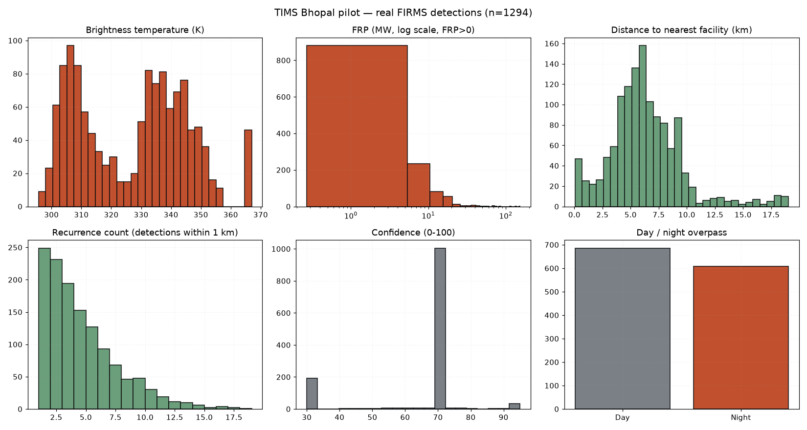

# EDA summary — TIMS Bhopal pilot (BHOPAL-01)

Generated by `ml/clean_eda.py` from real NASA FIRMS records held in
PostgreSQL. No synthetic, augmented or interpolated rows are present.

## Dataset

- Rows after cleaning: **1294**
- Date range: **2024-02-02 07:54:00+00:00** to **2026-05-01 20:43:00+00:00**
- All rows inside the Bhopal district polygon: **True**

### Provenance by FIRMS product

| Product | Rows |
| --- | --- |
| `VIIRS_SNPP_SP` | 618 |
| `VIIRS_NOAA20_SP` | 605 |
| `MODIS_SP` | 71 |

`_SP` products are the FIRMS **archive**. The pilot bounding box has no
near-real-time detections in September (monsoon), so the ingest widened to
the documented February-April fire season and recorded that it had done so.

## Cleaning log

- No duplicate hotspot ids (externalId uniqueness held)
- All rows carry a valid coordinate
- All brightness values within the physical range [250.0, 550.0] K
- All FRP values within [0.0, 5000.0] MW
- 0 row(s) report FRP = 0. Kept as-is: zero is a genuine low-power reading, and imputing a mean would invent radiative power.
- All confidence values normalised to 0-100 (VIIRS l/n/h -> 30/70/95)
- Every row has a real PostGIS-computed distance to its nearest facility
- All rows are inside the Bhopal district polygon (ST_Within)
- Rows: 1294 in -> 1294 out (0 removed)

## Feature distributions

```
       brightness      frp  confidence  distance_to_facility_m  recurrence_count  persistence_days
count     1294.00  1294.00     1294.00                 1294.00           1294.00           1294.00
mean       327.18     5.97       64.43                 6319.14              4.15              1.69
std         18.30    10.34       15.28                 3280.18              3.03              0.95
min        295.65     0.27       30.00                   60.44              1.00              1.00
25%        308.78     1.40       70.00                 4443.88              2.00              1.00
50%        331.28     2.93       70.00                 5942.21              3.00              1.00
75%        341.93     7.12       70.00                 7864.30              6.00              2.00
max        367.00   152.80       95.00                19021.73             18.00              7.00
```



## Correlations

```
                        brightness    frp  distance_to_facility_m  recurrence_count  is_night
brightness                   1.000  0.433                   0.044            -0.004    -0.836
frp                          0.433  1.000                   0.003             0.048    -0.370
distance_to_facility_m       0.044  0.003                   1.000            -0.091    -0.050
recurrence_count            -0.004  0.048                  -0.091             1.000     0.133
is_night                    -0.836 -0.370                  -0.050             0.133     1.000
```

## Observations

- **FRP is strongly right-skewed**: median 2.93 MW, p90 12.80 MW, max 152.8 MW. These are kilns, workshops and crop/vegetation fires, not refinery flares, so risk thresholds calibrated nationally would misclassify almost everything here.
- **Industrial co-location is rare**: 61 of 1294 detections (4.7%) fall within 1 km of a mapped industrial site, and 154 (11.9%) within 3 km. Any classifier trained on proximity-derived labels will therefore face heavy class imbalance.
- **Night detections dominate**: 47.0% of passes are night-time, which is expected for VIIRS overpass timing and means `is_night` alone is a weak discriminator in this dataset.
- **212 detections recur on 3 or more days**, which is the signal the persistent-thermal-source class depends on.

## Limitation

There is **no verified ground truth** for these detections. No fire-department
incident log, MPPCB inspection record or satellite-image confirmation has been
joined to them. Everything downstream of this file trains on *heuristic weak
labels* (see `weak_labels.py`), and the reported metrics measure agreement with
those heuristics — not real-world classification accuracy.
