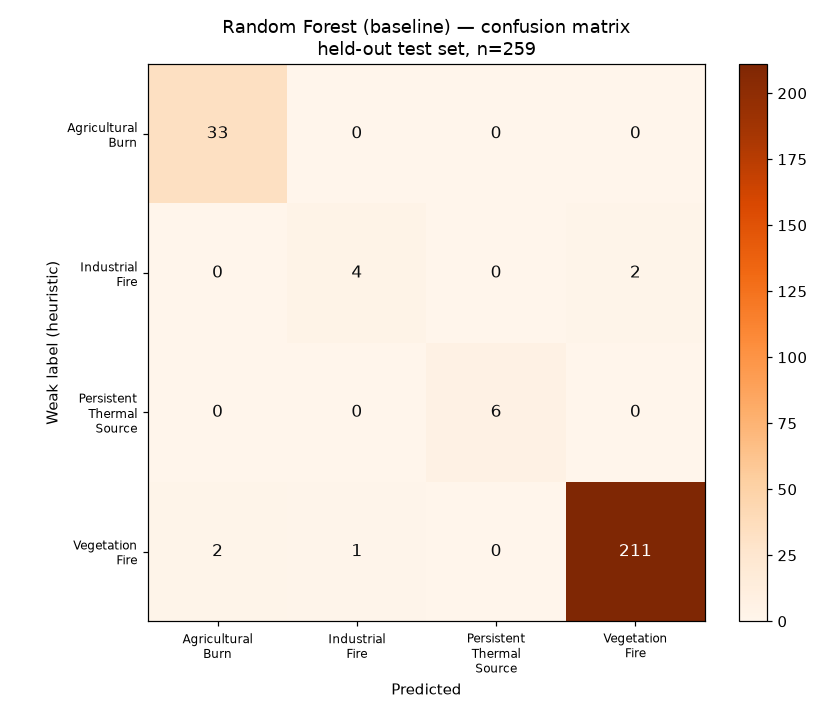
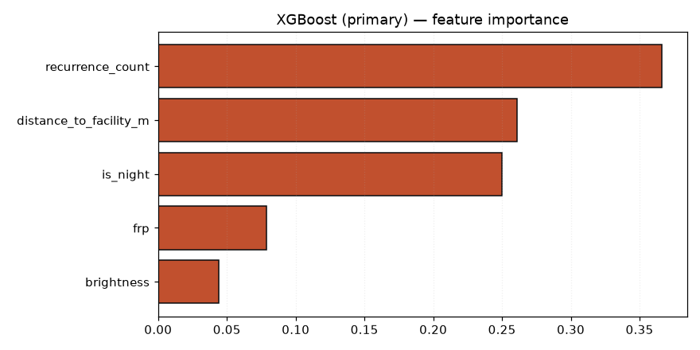

# Model report — TIMS Bhopal pilot (BHOPAL-01)

> **Trained on heuristic weak labels, not ground truth.** Every figure below
> measures agreement with the labelling rules in `weak_labels.py`. It is not
> evidence that TIMS classifies real fires correctly.

- Model version: `bhopal-01-v1`
- Selected algorithm: **XGBoost (primary)**
- Trained at: 2026-09-15T07:47:42.939441+00:00
- Features: `brightness`, `frp`, `distance_to_facility_m`, `recurrence_count`, `is_night`

## Dataset

- Total rows: **1294** real NASA FIRMS detections
- Train / test: 1035 / 259 (stratified 20% held out)
- Date range: 2024-02-02 07:54:00+00:00 to 2026-05-01 20:43:00+00:00

| Weak label | Rows |
| --- | --- |
| `POSSIBLE_AGRICULTURAL_BURN` | 164 |
| `POSSIBLE_INDUSTRIAL_FIRE` | 29 |
| `POSSIBLE_PERSISTENT_THERMAL_SOURCE` | 30 |
| `POSSIBLE_VEGETATION_FIRE` | 1071 |

## Held-out test results

| Model | Accuracy | Macro F1 | Weighted F1 |
| --- | --- | --- | --- |
| XGBoost (primary) | 0.9614 | 0.8425 | 0.9636 |
| Random Forest (baseline) | 0.9807 | 0.9215 | 0.9803 |

Macro F1 is the headline metric, not accuracy: with ~83% of rows in one class,
a model that only ever predicted that class would score 0.83 accuracy while
being operationally worthless.

### XGBoost (primary) — per class

| Class | Precision | Recall | F1 | Support |
| --- | --- | --- | --- | --- |
| `POSSIBLE_AGRICULTURAL_BURN` | 0.941 | 0.970 | 0.955 | 33 |
| `POSSIBLE_INDUSTRIAL_FIRE` | 0.556 | 0.833 | 0.667 | 6 |
| `POSSIBLE_PERSISTENT_THERMAL_SOURCE` | 0.714 | 0.833 | 0.769 | 6 |
| `POSSIBLE_VEGETATION_FIRE` | 0.990 | 0.967 | 0.979 | 214 |

Confusion matrix (rows = weak label, columns = predicted):

| | AGRICULTURAL_BURN | INDUSTRIAL_FIRE | PERSISTENT_THERMAL_SOURCE | VEGETATION_FIRE |
| --- | --- | --- | --- | --- |
| **AGRICULTURAL_BURN** | 32 | 0 | 0 | 1 |
| **INDUSTRIAL_FIRE** | 0 | 5 | 0 | 1 |
| **PERSISTENT_THERMAL_SOURCE** | 0 | 1 | 5 | 0 |
| **VEGETATION_FIRE** | 2 | 3 | 2 | 207 |

### Random Forest (baseline) — per class

| Class | Precision | Recall | F1 | Support |
| --- | --- | --- | --- | --- |
| `POSSIBLE_AGRICULTURAL_BURN` | 0.943 | 1.000 | 0.971 | 33 |
| `POSSIBLE_INDUSTRIAL_FIRE` | 0.800 | 0.667 | 0.727 | 6 |
| `POSSIBLE_PERSISTENT_THERMAL_SOURCE` | 1.000 | 1.000 | 1.000 | 6 |
| `POSSIBLE_VEGETATION_FIRE` | 0.991 | 0.986 | 0.988 | 214 |

Confusion matrix (rows = weak label, columns = predicted):

| | AGRICULTURAL_BURN | INDUSTRIAL_FIRE | PERSISTENT_THERMAL_SOURCE | VEGETATION_FIRE |
| --- | --- | --- | --- | --- |
| **AGRICULTURAL_BURN** | 33 | 0 | 0 | 0 |
| **INDUSTRIAL_FIRE** | 0 | 4 | 0 | 2 |
| **PERSISTENT_THERMAL_SOURCE** | 0 | 0 | 6 | 0 |
| **VEGETATION_FIRE** | 2 | 1 | 0 | 211 |

## 5-fold stratified cross-validation (macro F1)

**Model selection is based on this table, not the single split above.**

| Model | Mean | Std |
| --- | --- | --- |
| XGBoost (primary) | 0.9063 | 0.0744 |
| Random Forest (baseline) | 0.8757 | 0.0875 |

Cross-validation matters here: a single 20% split leaves only ~6 rows of each
minority class in the test set, so one misclassification moves its recall by
17 percentage points.

## Feature importance

| Feature | Importance |
| --- | --- |
| `recurrence_count` | 0.3661 |
| `distance_to_facility_m` | 0.2611 |
| `is_night` | 0.2502 |
| `frp` | 0.0785 |
| `brightness` | 0.0442 |

## How to read these numbers honestly

1. **The labels are heuristics.** No incident log or image confirmation was
   joined to these detections, so there is no ground truth to be accurate against.
2. **The task is partly circular.** `distance_to_facility_m` is both a labelling
   rule and a model feature, so a high score largely reflects the model
   recovering thresholds it was trained on. Expect `distance_to_facility_m` to
   dominate feature importance for exactly this reason.
3. **The minority classes are small.** Industrial and persistent-source classes
   have roughly 30 examples each. Their per-class metrics are indicative only.
4. **Class imbalance is real, not fixed.** Balanced sample weights stop the
   majority class swamping training, but they do not create information that
   30 examples do not contain.

## What the model is actually for

It makes the labelling logic available as a fast, versioned service with a
calibrated-looking confidence, so the backend can attach a class and a score to
each detection at ingest time and record which code path produced it. When the
service is unreachable the backend falls back to the rule engine and records
`classificationPath = RULE_FALLBACK`, so the UI never implies a model prediction
that did not happen.
